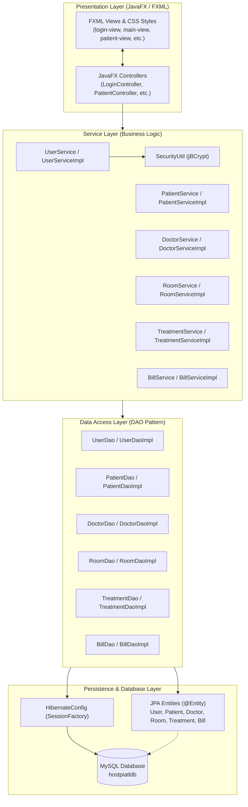
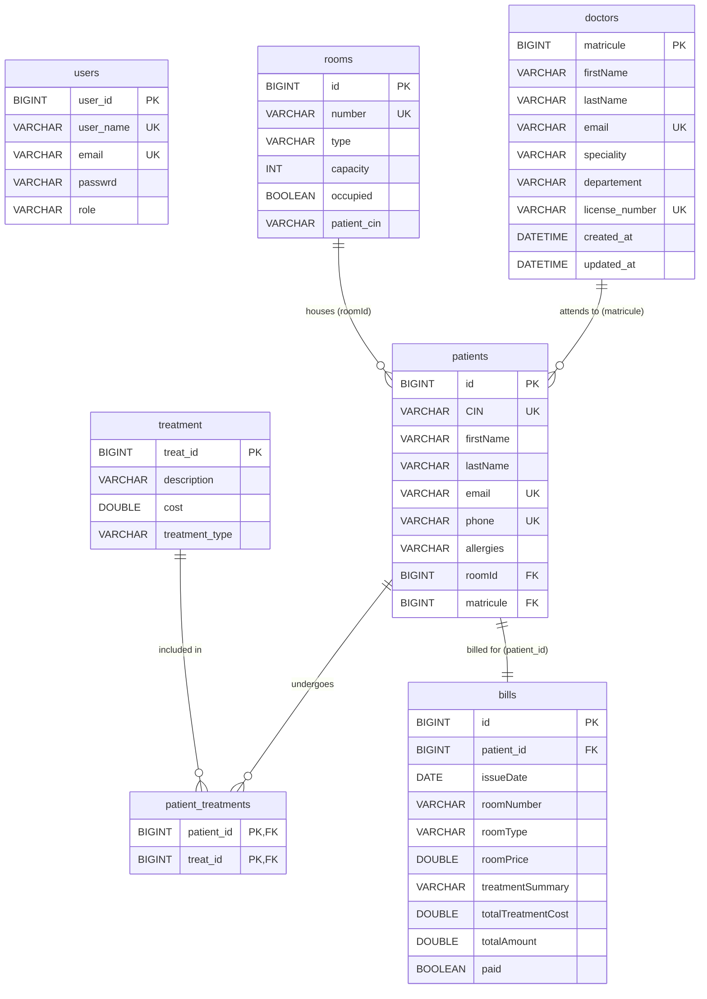

# 🏥 MediCare - Hospital Management System (DoctorHibernate)

[](https://openjdk.org/)
[](https://openjfx.io/)
[](https://hibernate.org/orm/)
[](https://jakarta.ee/specifications/persistence/)
[](https://www.mysql.com/)
[](https://maven.apache.org/)
[](https://www.mindrot.org/projects/jBCrypt/)
[](https://projectlombok.org/)

A modular desktop **Hospital Management System (HMS)** built with **JavaFX 21**, **Hibernate ORM 7**, **Jakarta Persistence (JPA)**, and **MySQL**. MediCare streamlines patient intake, doctor directory management, inpatient room bed tracking, medical treatment cataloging, and automated patient billing with cryptographic authentication.

---

## 📑 Table of Contents

- [Overview](#-overview)
- [Key Features](#-key-features)
- [System Architecture](#-system-architecture)
- [Entity-Relationship (ER) Model](#-entity-relationship-er-model)
- [Tech Stack](#-tech-stack)
- [Project Directory Structure](#-project-directory-structure)
- [Prerequisites & Requirements](#-prerequisites--requirements)
- [Database Setup & Configuration](#-database-setup--configuration)
- [Installation & Getting Started](#-installation--getting-started)
- [Default Login Credentials](#-default-login-credentials)
- [Application Modules Walkthrough](#-application-modules-walkthrough)
- [Design Patterns & Architecture Highlights](#-design-patterns--architecture-highlights)
- [Troubleshooting & FAQ](#-troubleshooting--faq)
- [Roadmap & Future Improvements](#-roadmap--future-improvements)
- [License](#-license)

---

## 📖 Overview

**MediCare** (internal artifact `DoctorHibernate`) provides healthcare administrative staff and clinical managers with a centralized desktop interface to oversee clinical and operational hospital workflows:

1. **Authentication & Access Control**: Secure login protected by industry-standard BCrypt salted password hashing, DTO abstraction, and automatic admin bootstrap seeding.
2. **Patient Admission & Records**: Registration with Moroccan National Identity Card (CIN), email, contact numbers, allergies, room allocation, attending physician assignment, and multi-treatment linking.
3. **Doctor Directory**: Physician records cataloged by speciality, hospital department, and medical license number, with automatic entity audit timestamps.
4. **Room & Bed Capacity**: Real-time room tracking (e.g., ICU, General Ward) with strict bed capacity limits (1–4 beds) and live occupancy enforcement.
5. **Medical Treatments & Procedures**: Cataloging medical procedures across five categories (*Consultation, Surgery, Radiology, Lab Analysis, Emergency*) with cost controls and type-based filtering.
6. **Automated Billing Engine**: Invoice generator that calculates room hospitalization rates (e.g. ICU vs Standard) and itemized treatment fees into one invoice record.

---

## ✨ Key Features

### 🔐 1. Authentication & Security
- **BCrypt Salting & Hashing**: Password hashes are salted and verified with `BCrypt.hashpw()` and `BCrypt.checkpw()`.
- **Automatic Admin Seeding**: On initial startup, the application verifies database state and seeds a default administrative account (`admin` / `admin123`) if none exists.
- **DTO Credential Shielding**: Transfers authenticated state through `UserDto` without exposing sensitive password hash data to UI controllers.

### 👨‍🦱 2. Patient Registration & Inpatient Tracking
- **Identity & Contact**: Captures patient first name, last name, CIN (unique identity), email, phone number, and clinical allergies.
- **Capacity-Enforced Room Booking**: Prevents overbooking by verifying room capacity prior to patient assignment.
- **Physician Assignment**: Direct `@ManyToOne` association linking patients to attending doctors.
- **Multi-Treatment Assignment**: Multi-select ListView interface mapping multiple treatments through an eager `@ManyToMany` join table (`patient_treatments`).
- **Dynamic Search**: Instant memory and query-level filtering across CIN, names, and contact emails.

### 👨‍⚕️ 3. Doctor Management
- **Staff Profiles**: Speciality (Cardiology, Surgery, etc.), hospital department, email, and medical license number.
- **Uniqueness Validation**: Business-layer validation ensuring duplicate emails and license numbers are rejected before persistence.
- **Automatic Auditing**: Manages `createdAt` and `updatedAt` timestamps for auditing doctor roster changes.

### 🛏 4. Hospital Room & Ward Management
- **Room Categorization**: Categorize rooms (e.g., `ICU`, `General Ward`, `Maternity Wing`).
- **Configurable Bed Capacity**: JavaFX `Spinner` constraints enforcing bed allocations between 1 and 4 beds per room.
- **Interactive Action Cells**: Custom JavaFX `TableCell` components providing direct ✏️ *Edit* and 🗑️ *Delete* actions inside the table rows.

### 💊 5. Medical Treatments & Procedures
- **Procedure Categorization**: Uses `TreatmentType` enum:
  - 🩺 `CONSULTATION` (*Consultation*)
  - 🔪 `CHIRURGIE` (*Chirurgie / Surgery*)
  - 🩻 `RADIOLOGIE` (*Radiologie / Radiology*)
  - 🔬 `ANALYSE` (*Analyse Médicale / Lab Tests*)
  - 🚨 `URGENCE` (*Urgence / Emergency*)
- **Filterable Data Views**: Real-time `FilteredList` filtering by procedure type.
- **Cost Integrity**: Strict numerical and positive cost validation.

### 💰 6. Billing & Invoicing Engine
- **Automated Rate Calculation**:
  - **Room Rates**: Calculates charges according to room tier (e.g., `$500.00` for ICU, `$200.00` for General wards).
  - **Treatment Summation**: Aggregates all recorded treatments linked to the patient into an itemized summary string and calculates the total cost.
- **Invoice Tracking**: Records issue dates, snapshot data (room number, room type, patient CIN), totals, and payment status (`Paid` / `Pending`).

---

## 🏛 System Architecture

The application adopts a **Layered Clean Architecture** separating UI, Business Services, Data Access, and Persistence:



---

## 🗄 Entity-Relationship (ER) Model



---

## 💻 Tech Stack

| Component | Technology | Version | Description |
| :--- | :--- | :--- | :--- |
| **Language** | Java (JDK) | 21 (LTS) / 25 | Modular Java application (`module-info.java`) |
| **UI Framework** | OpenJFX (JavaFX) | 21.0.6 | Declarative FXML, Controls, and CSS |
| **ORM / Persistence** | Hibernate ORM | 7.2.0.Final | Object-Relational Mapping & HQL queries |
| **JPA Standard** | Jakarta Persistence API | 3.2.0 | Annotations (`@Entity`, `@Table`, `@ManyToOne`, etc.) |
| **Database** | MySQL | 8.0+ | Relational SQL database engine |
| **JDBC Driver** | MySQL Connector/J | 8.0.33 | High-performance MySQL Java driver |
| **Password Hashing**| jBCrypt | 0.4 | Blowfish adaptive crypt hashing |
| **Productivity** | Project Lombok | 1.18.42 | Compile-time `@Getter`, `@Setter`, `@NoArgsConstructor` |
| **Logging** | SLF4J + Logback Classic | 2.0.17 / 1.5.23 | Structured application and Hibernate logging |
| **Testing** | JUnit Jupiter | 5.12.1 | Unit testing framework |
| **Build Tool** | Apache Maven | 3.9+ | Dependency management and build lifecycle |

---

## 📂 Project Directory Structure

```plaintext
Javafx/
├── .mvn/                                # Maven wrapper configuration
│   └── wrapper/
│       └── maven-wrapper.properties
├── mvnw                                 # Maven wrapper script (Unix)
├── mvnw.cmd                             # Maven wrapper script (Windows)
├── pom.xml                              # Project Object Model (dependencies, plugins)
└── src/
    └── main/
        ├── java/
        │   ├── module-info.java         # Java Module System definition
        │   └── com/example/doctorhibernate/
        │       ├── HospitalApplication.java   # JavaFX Application entrypoint (Loads Login)
        │       ├── Launcher.java              # JavaFX Main-class Bootstrap launcher
        │       ├── config/
        │       │   └── HibernateConfig.java   # SessionFactory singleton manager
        │       ├── controller/
        │       │   ├── LoginController.java   # Authentication controller
        │       │   ├── MainController.java    # Master navigation & view switcher
        │       │   ├── PatientController.java # Patient CRUD & relationships
        │       │   ├── DoctorController.java  # Doctor roster management
        │       │   ├── RoomController.java    # Hospital rooms & bed capacity
        │       │   ├── TreatmentController.java# Medical treatments catalog
        │       │   └── BillController.java    # Invoice generation & billing
        │       ├── dao/
        │       │   ├── BillDao.java
        │       │   ├── DoctorDao.java
        │       │   ├── PatientDao.java
        │       │   ├── RoomDao.java
        │       │   ├── TreatmentDao.java
        │       │   ├── UserDao.java
        │       │   └── daoImpl/
        │       │       ├── BillDaoImpl.java
        │       │       ├── DoctorDaoImpl.java
        │       │       ├── PatientDaoImpl.java
        │       │       ├── RoomDaoImpl.java
        │       │       ├── TreatmentDaoImpl.java
        │       │       └── UserDaoImpl.java
        │       ├── dto/
        │       │   └── UserDto.java           # Data Transfer Object for authenticated user
        │       ├── entities/
        │       │   ├── Bill.java              # JPA Entity: Patient invoice
        │       │   ├── Doctor.java            # JPA Entity: Attending physician
        │       │   ├── Patient.java           # JPA Entity: Inpatient record
        │       │   ├── Room.java              # JPA Entity: Hospital room & ward
        │       │   ├── Treatment.java         # JPA Entity: Medical procedure
        │       │   ├── TreatmentType.java     # Enum: Procedure categories
        │       │   └── User.java              # JPA Entity: System administrative user
        │       ├── exception/
        │       │   └── AppException.java      # Unchecked application domain exception
        │       ├── service/
        │       │   ├── BillService.java
        │       │   ├── DoctorService.java
        │       │   ├── PatientService.java
        │       │   ├── RoomService.java
        │       │   ├── TreatmentService.java
        │       │   ├── UserService.java
        │       │   └── Impl/
        │       │       ├── BillServiceImpl.java
        │       │       ├── DoctorServiceImpl.java
        │       │       ├── PatientServiceImpl.java
        │       │       ├── RoomServiceImpl.java
        │       │       ├── TreatmentServiceImpl.java
        │       │       └── UserServiceImpl.java
        │       └── util/
        │           └── SecurityUtil.java      # BCrypt encryption & verification
        └── resources/
            ├── db.properties                  # Database connection parameters
            ├── hibernate.cfg.xml              # Hibernate 7 SessionFactory XML config
            └── com/example/doctorhibernate/
                ├── bill-view.fxml             # Invoicing view
                ├── doctor-view.fxml           # Doctor management view
                ├── login-view.fxml            # Authentication view
                ├── main-view.fxml             # Main dashboard container view
                ├── patient-view.fxml          # Patient intake view
                ├── room-view.fxml             # Room management view
                ├── Treatment-view.fxml        # Treatments & care view
                └── styles.css                 # Application CSS theme & styles
```

---

## ⚙️ Prerequisites & Requirements

Before building and running the project, verify that your environment satisfies:

1. **Java Development Kit (JDK)**: JDK 21 (LTS) or JDK 25 installed. Verify via:
   ```bash
   java -version
   javac -version
   ```
2. **Apache Maven**: Version 3.9.0 or newer (or use the included `./mvnw` wrapper). Verify via:
   ```bash
   mvn -version
   ```
3. **MySQL Database Server**: Version 8.0 or newer running locally or accessible remotely. Verify via:
   ```bash
   mysql --version
   ```

> [!IMPORTANT]
> **Java Version Configuration**:
> If your system runs JDK 21 (LTS), ensure the `<maven-compiler-plugin>` configuration in [pom.xml](file:///home/hnabil/Desktop/Javafx/pom.xml#L94-L95) uses `<source>21</source>` and `<target>21</target>`. If targeting JDK 25, ensure a compatible JDK 25 runtime is active.

---

## 🗄 Database Setup & Configuration

### 1. Create MySQL Database
Log into MySQL and execute:

```sql
CREATE DATABASE IF NOT EXISTS hostpiatldb 
    CHARACTER SET utf8mb4 
    COLLATE utf8mb4_unicode_ci;
```

### 2. Configure Database Credentials
Configure your database host, port, user, and password in:
- `src/main/resources/hibernate.cfg.xml`:
  ```xml
  <property name="hibernate.connection.url">jdbc:mysql://localhost:3306/hostpiatldb</property>
  <property name="hibernate.connection.username">root</property>
  <property name="hibernate.connection.password">root</property>
  ```
- `src/main/resources/db.properties`:
  ```properties
  db.url=jdbc:mysql://localhost:3306/hostpiatldb
  db.usrname=root
  db.pssrd=root
  ```

> [!NOTE]
> Thanks to Hibernate's schema auto-generation (`<property name="hibernate.hbm2ddl.auto">update</property>`), all database tables (`users`, `doctors`, `rooms`, `patients`, `treatment`, `patient_treatments`, `bills`) are generated and updated automatically upon initial application boot.

---

## 🚀 Installation & Getting Started

### 1. Clone the Repository
```bash
git clone git@github.com:hilalinabil/Javafx.git
cd Javafx
```

### 2. Verify / Adjust Target Java Version
If running on **Java 21**, ensure your [pom.xml](file:///home/hnabil/Desktop/Javafx/pom.xml) matches your installed JDK:
```xml
<plugin>
    <groupId>org.apache.maven.plugins</groupId>
    <artifactId>maven-compiler-plugin</artifactId>
    <version>3.13.0</version>
    <configuration>
        <source>21</source>
        <target>21</target>
    </configuration>
</plugin>
```

### 3. Build the Project
Compile and package the project:
```bash
# Using local Maven
mvn clean compile

# Or using Maven Wrapper
./mvnw clean compile
```

### 4. Run the Application
Launch MediCare using the JavaFX Maven plugin:
```bash
mvn javafx:run
```
Alternatively, execute the standalone launcher:
```bash
mvn compile exec:java -Dexec.mainClass="com.example.doctorhibernate.Launcher"
```

### 5. Running from an IDE (IntelliJ IDEA / Eclipse / VS Code)
1. Open the project folder as a Maven project.
2. Ensure Project SDK is set to **JDK 21** or **JDK 25**.
3. Enable **Annotation Processing** (Settings → Build, Execution, Deployment → Compiler → Annotation Processors → *Enable annotation processing*) to allow Lombok to generate getters and setters.
4. Locate [Launcher.java](file:///home/hnabil/Desktop/Javafx/src/main/java/com/example/doctorhibernate/Launcher.java) or [HospitalApplication.java](file:///home/hnabil/Desktop/Javafx/src/main/java/com/example/doctorhibernate/HospitalApplication.java) and click **Run**.

---

## 🔑 Default Login Credentials

Upon first launching the system, [UserServiceImpl](file:///home/hnabil/Desktop/Javafx/src/main/java/com/example/doctorhibernate/service/Impl/UserServiceImpl.java#L21-L37) executes `seedAdminUser()`. If no admin exists in the database, it registers the following default administrator:

| Field | Value |
| :--- | :--- |
| **Username** | `admin` |
| **Password** | `admin123` |
| **Role** | `ADMIN` |
| **Email** | `admin@hospital.com` |

---

## 🖥 Application Modules Walkthrough

```plaintext
+---------------------------------------------------------------------------------+
|  🏥 MediCare  Admin Panel                                                       |
+-------------------+-------------------------------------------------------------+
|  MANAGEMENT       |                                                             |
|  👨‍🦱  Patients    |   Patient Registration & Management                         |
|  👨‍⚕️  Doctors     |   +--------------------------+------------------------------+
|  🛏  Rooms        |   | Personal Information     |  ID | Name   | Room | Doctor |
|  💊  Treatments   |   | First / Last / CIN       |  1  | John D | 101  | Dr.Ali |
|  💰  Billing      |   | Room & Doctor Selectors  |  2  | Sara K | 204  | Dr.Eve |
|                   |   | Treatments Multi-Select  |                              |
|  ---------------  |   | [✓ Register]  [🗑 Delete]|                              |
|  🚪  Log Out      |   +--------------------------+------------------------------+
+-------------------+-------------------------------------------------------------+
```

### 1. Login View (`login-view.fxml`)
- Minimalist card modal prompting for username and password.
- Validates non-empty input and delegates authentication to `UserService.login(...)`.
- On success, smoothly transitions the current stage to `main-view.fxml`.

### 2. Main Dashboard Layout (`main-view.fxml`)
- Provides a responsive `BorderPane` framework with a dark sidebar navigation (`.sidebar-dark`).
- Dynamically swaps center views (`patient-view.fxml`, `doctor-view.fxml`, `room-view.fxml`, `Treatment-view.fxml`, `bill-view.fxml`) without flickering or spawning detached windows.

### 3. Patient Management (`patient-view.fxml`)
- Left form panel with personal information inputs and clinical dropdowns.
- Real-time room occupancy verification: alerts the user if a selected room has reached maximum bed capacity.
- Attending doctor assignment dropdown.
- Multi-selection ListView for prescribing treatments simultaneously.
- Responsive table with custom cell formatters presenting attending doctors (`Dr. LastName`), rooms (`101 (ICU)`), and active treatment badges.

### 4. Doctor Roster (`doctor-view.fxml`)
- Form inputs for doctor name, email, department, speciality, and license number.
- Table selection listener: clicking any doctor row in the table populates the input form and switches the action button from *Save Doctor* to *Update Doctor*.
- Confirmation alert dialog safeguarding against accidental doctor deletion.

### 5. Hospital Rooms (`room-view.fxml`)
- Room number, room type (ICU, Standard, Ward), capacity (1–4 beds using JavaFX `Spinner`), and occupancy checkbox.
- Custom inline table action buttons (✏️ *Edit* / 🗑️ *Delete*) inside each row.

### 6. Medical Treatments (`Treatment-view.fxml`)
- Form to define treatment descriptions, categories (`TreatmentType` enum), and pricing.
- Live category filtering via `FilteredList` to isolate specific procedures (e.g. only Radiology or Surgery).

### 7. Invoicing & Billing (`bill-view.fxml`)
- Select patient from dropdown to automatically compute room fees ($500 for ICU, $200 for standard) plus procedure fees.
- Summarizes invoice data into a clean table with total cost calculations and status tracking.

---

## 🏗 Design Patterns & Architecture Highlights

1. **Model-View-Controller (MVC)**:
   - Views defined declaratively in XML (`.fxml`) and styled using CSS (`styles.css`).
   - Controllers handle event handling, state binding, and UI validation.
2. **Data Access Object (DAO) Pattern**:
   - Isolates database operations behind interfaces (`DoctorDao`, `PatientDao`, etc.).
   - Concrete implementations encapsulate Hibernate transactions, HQL queries, and rollbacks.
3. **Data Transfer Object (DTO) Pattern**:
   - `UserDto` shields administrative entity internals (passwords, timestamps) from presentation controllers.
4. **Custom Domain Exceptions**:
   - `AppException` provides informative runtime error messages displayed cleanly in JavaFX error dialogs.
5. **Java Module System (`module-info.java`)**:
   - Configures explicit modular boundaries:
   ```java
   module com.example.doctorhibernate {
       requires java.naming;
       requires java.sql;
       requires javafx.controls;
       requires javafx.fxml;
       requires jakarta.persistence;
       requires org.slf4j;
       requires mysql.connector.j;
       requires org.hibernate.orm.core;
       requires static lombok;
       requires jbcrypt;
       requires java.desktop;

       opens com.example.doctorhibernate.controller to javafx.fxml;
       opens com.example.doctorhibernate to javafx.fxml;
       opens com.example.doctorhibernate.entities to org.hibernate.orm.core;
       exports com.example.doctorhibernate;
       exports com.example.doctorhibernate.exception;
       opens com.example.doctorhibernate.exception to javafx.fxml;
   }
   ```

---

## ❓ Troubleshooting & FAQ

### Q1: `Fatal error compiling: error: invalid target release: 25`
**Cause**: Maven is instructed to compile for Java 25, but your local environment has JDK 21 installed.  
**Solution**: Edit [pom.xml](file:///home/hnabil/Desktop/Javafx/pom.xml#L94-L95) and change the compiler plugin configuration from `25` to `21`:
```xml
<configuration>
    <source>21</source>
    <target>21</target>
</configuration>
```

### Q2: `Communications link failure / Connection refused: connect`
**Cause**: MySQL is not running or the port/host in `hibernate.cfg.xml` is incorrect.  
**Solution**:
1. Check if MySQL is active: `sudo systemctl status mysql` (Linux) or check Windows Services.
2. Verify credentials in `hibernate.cfg.xml` and `db.properties`.
3. Verify that the database exists: `CREATE DATABASE hostpiatldb;`.

### Q3: `Caused by: java.lang.reflect.InaccessibleObjectException`
**Cause**: The Java Module System is preventing JavaFX or Hibernate from accessing entity fields or controller methods via reflection.  
**Solution**: Verify `module-info.java` contains the necessary `opens ... to ...` directives (already configured for `javafx.fxml` and `org.hibernate.orm.core`).

### Q4: Lombok getters/setters not found during IDE build
**Cause**: Annotation processing is disabled in the IDE.  
**Solution**: In IntelliJ IDEA, navigate to `Settings` → `Build, Execution, Deployment` → `Compiler` → `Annotation Processors` and check **Enable annotation processing**.

---

## 🗺 Roadmap & Future Improvements

- [ ] **Role-Based Access Control (RBAC)**: Support specialized roles (`DOCTOR`, `NURSE`, `RECEPTIONIST`) with scoped UI access.
- [ ] **PDF Invoice Export**: Integrate iText or JasperReports to generate printable patient bills with hospital headers.
- [ ] **Appointment Scheduling Calendar**: Interactive JavaFX calendar for booking consultations with doctors.
- [ ] **Patient Discharge Workflow**: Automated room occupancy clearance upon invoice settlement and discharge.
- [ ] **Connection Pooling (HikariCP / C3P0)**: Enable production connection pooling for enhanced query throughput.

---

## 📄 License

This project is open-source and available for educational and commercial reference. See the repository for specific licensing terms.

---

*Developed with ❤️ using JavaFX, Hibernate, and MySQL.*
